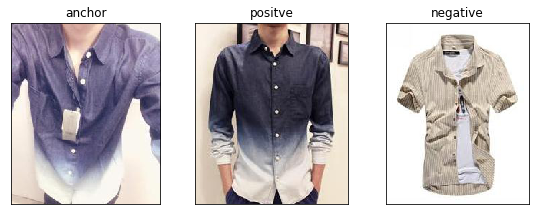
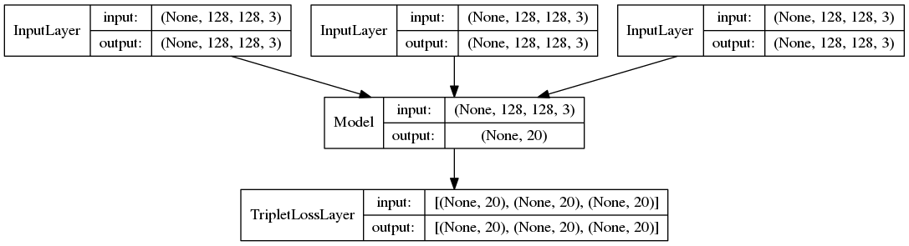
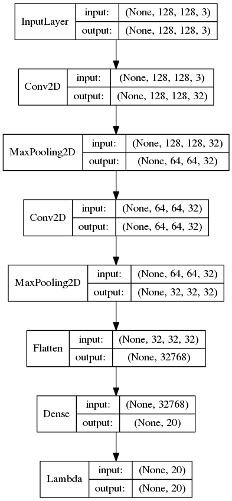

# street2shop
## Task
Clothes image retrieval from consumer(street) image to shop(online) image.

## Method 
TripletNet

## Implementation
These notebooks are implemented by python3.5 or 3.6, keras 2.2.1 

## Sample Dataset
- anchor = street image
- positive = shop image consistent to anchor
- negative = shop image not consistent to anchor
####  example

## Network
#### whole structure

#### embNet structure

