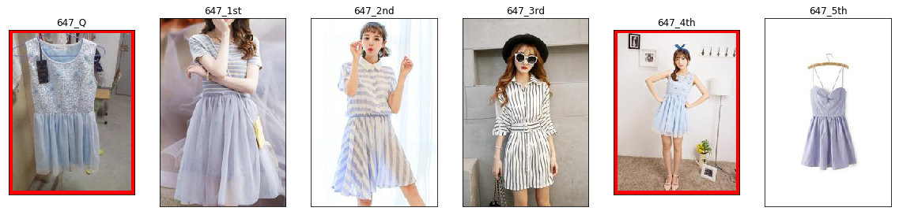
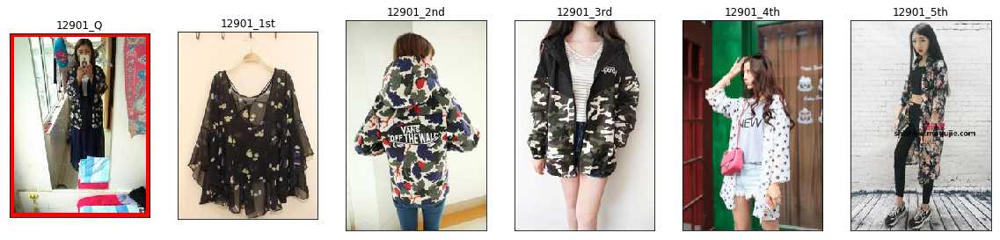
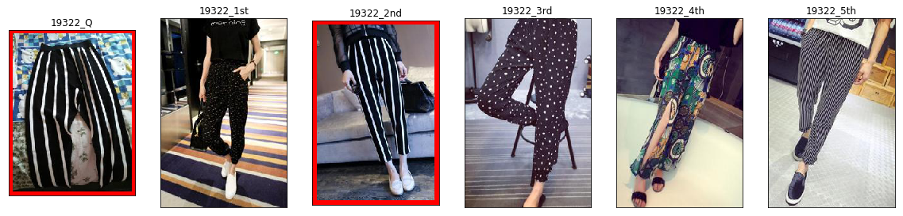

# Street2Shop implementation with keras

## Task
Clothing image retrieval from consumer(street) image to shop(online) image.

### Goal
Compare Models for clothing retrieval.
Main: VGG16 + Triplet Loss/Improved Triplet Loss
1. SingleNetwork for one input
2. DualNetwork for one input
## Dataset
I used `DeepFashion` Dataset to train and test my model.
- anchor = street image
- positive = shop image consistent to anchor
- negative = shop image not consistent to anchor

###  data example


### Retrieval Sample
T_Shirt


Dress


Coat


Pants


## Implementation
These notebooks are implemented by python3.5 or 3.6, keras 2.2.1. Sorry, I use Japanese for comment in my notebook, haha.
Please execute this command for building my environment.
I trained models for one category respectively.

```shell
$ conda env create -n {new environment name} -f env_zkk.yml
```

## Reference
- DeepFashion(https://liuziwei7.github.io/projects/DeepFashion.html)

## notion
If you encount the error like below, please `Quite` jupyter process.

```
Failed to get convolution algorithm. This is probably because cuDNN failed to initialize, so try looking to see if a warning log message was printed above.
```
If you close tab without `Quit`, the jupyter-process would be zombie process. 
GPU would be occupied by that process and you can't initialize a new process.

reference(https://qiita.com/Ka-k/items/cb942855ab669ff60630)
> 　TensorFlow-GPUは、デフォルトだとGPUの空いている領域をすべて確保しようとする。すべてです。ALL。
　つまり、TensorFlow-GPUを使った機械学習プログラムを複数同時に走らせると1つめは普通に通るけど2つめはGPUを確保できないので初期化に失敗する。これがcuDNN failed to initializeの正体。
　そしてJupyterをタブ閉じで終わらせるとGPUを確保したままゾンビ化する。その後Jupyterを立ち上げ直してもGPUはゾンビ化したコードに専有されたままなのでこれも初期化失敗する。これが1回目でも学習失敗する症状の正体。
　試しに1つめのコードを走らせたあと、Jupyter上でコードを停止させてから2つめを走らせると、普通に動いた。CUDAもcuDNNもAnacondaも悪くない。悪いのはGPUをひとり占めしようとするTensorFlowとタブを消したらゾンビ化するJupyterやったんや。
 
